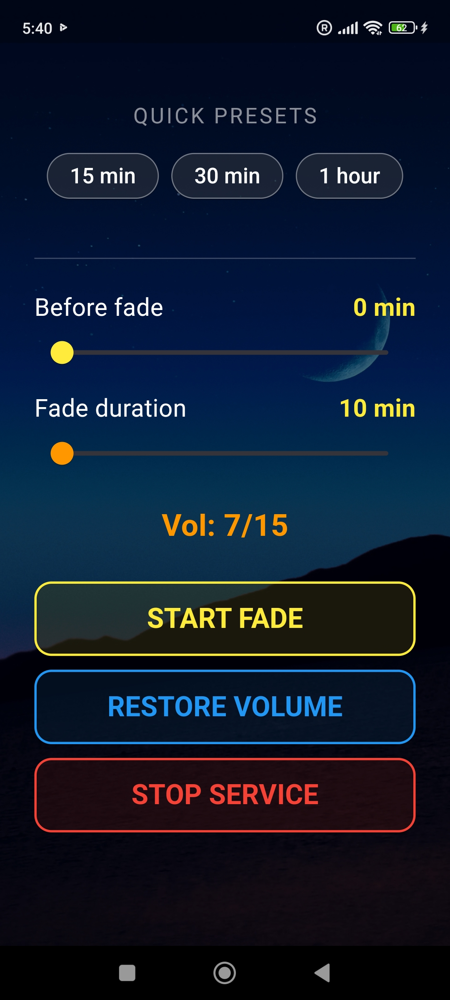
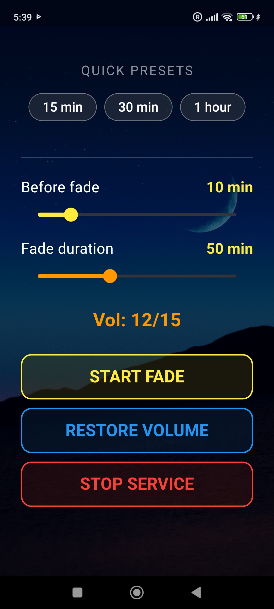
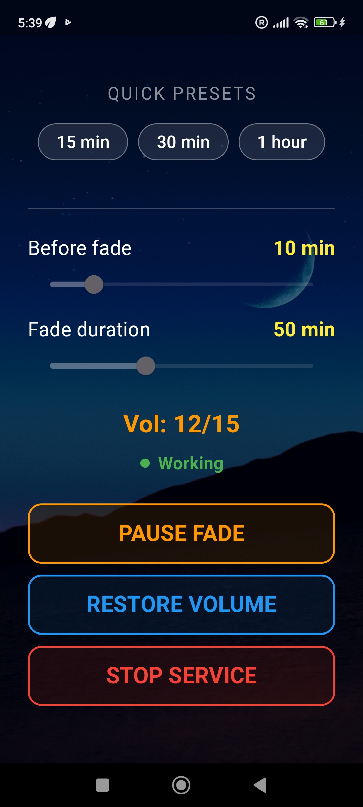

# volume_fade

A new Flutter project.

## Getting Started

This project is a starting point for a Flutter application.

A few resources to get you started if this is your first Flutter project:

- [Learn Flutter](https://docs.flutter.dev/get-started/learn-flutter)
- [Write your first Flutter app](https://docs.flutter.dev/get-started/codelab)
- [Flutter learning resources](https://docs.flutter.dev/reference/learning-resources)

For help getting started with Flutter development, view the
[online documentation](https://docs.flutter.dev/), which offers tutorials,
samples, guidance on mobile development, and a full API reference.
# Volume Fading 🌙🌊

### 🇷🇺 Русский
**Плавное затухание звука для комфортного сна.**
Приложение постепенно снижает громкость медиа, помогая вам уснуть под любимую музыку или звуки природы. 
* **Авторский дизайн:** В качестве фона используется реальное фото ночного моря, сделанное автором.
* **Умная пауза:** Если вы сами измените громкость, приложение поймет, что вы не спите, и остановится.
* **Пресеты:** Быстрый запуск на 15, 30 или 60 минут.

### 🇬🇧 English
**Gentle volume reduction for a peaceful sleep.**
The app gradually lowers media volume, helping you drift off to your favorite music or ambient sounds.
* **Authentic Design:** Featuring a real night sea photograph captured by the author as the background.
* **Smart Detection:** If you manually adjust the volume, the app detects you're awake and stops the service.
* **Quick Presets:** One-tap start for 15, 30, or 60 minutes.

### 🇺🇦 Українська
**Плавне згасання звуку для комфортного сну.**
Додаток поступово знижує гучність медіа, допомагаючи вам заснути під улюблену музику або звуки природи.
* **Авторський дизайн:** Як фон використовується реальне фото нічного моря, зроблене автором.
* **Розумна пауза:** Якщо ви самі зміните гучність, додаток зрозуміє, що ви не спите, і зупиниться.
* **Пресети:** Швидкий запуск на 15, 30 або 60 хвилин.

### 🇪🇸 Español
**Reducción gradual del volumen para un sueño reparador.**
La aplicación reduce suavemente el volumen de los medios, ayudándote a dormir con tu música favorita.
* **Diseño Auténtico:** Presenta una fotografía real del mar nocturno capturada por el autor como fondo.
* **Detección Inteligente:** Si ajustas el volumen manualmente, la app detecta que estás despierto y se detiene.
* **Ajustes Rápidos:** Inicio con un toque para 15, 30 o 60 minutos.
# Volume Fading 🌙🌊

  

**Volume Fading** — это минималистичное приложение, созданное для тех, кто любит засыпать под музыку, подкасты или звуки природы. Оно бережно снижает громкость вашего устройства до нуля, обеспечивая мягкий переход в глубокий сон.

---

## 🌍 Languages / Мови / Языки
[English](#english) | [Русский](#русский) | [Українська](#українська) | [Español](#español)

---

### 🇬🇧 English
**Gentle volume reduction for a peaceful sleep.**
The app gradually lowers media volume, helping you drift off to your favorite music or ambient sounds.
* **Authentic Design:** Featuring a real night sea photograph captured by the author as the background.
* **Smart Detection:** If you manually adjust the volume, the app detects you're awake and stops the service.
* **Quick Presets:** One-tap start for 15, 30, or 60 minutes.

---

### 🇷🇺 Русский
**Плавное затухание звука для комфортного сна.**
Приложение постепенно снижает громкость медиа, помогая вам уснуть под любимую музыку или звуки природы. 
* **Авторский дизайн:** В качестве фона используется реальное фото ночного моря, сделанное автором.
* **Умная пауза:** Если вы сами измените громкость, приложение поймет, что вы не спите, и остановится.
* **Пресеты:** Быстрый запуск на 15, 30 или 60 минут.

---

### 🇺🇦 Українська
**Плавне згасання звуку для комфортного сну.**
Додаток поступово знижує гучність медіа, допомагаючи вам заснути під улюблену музику або звуки природи.
* **Авторський дизайн:** Як фон використовується реальне фото нічного моря, зроблене автором.
* **Розумна пауза:** Якщо ви самі зміните гучність, додаток зрозуміє, що ви не спите, і зупиниться.
* **Пресети:** Швидкий запуск на 15, 30 або 60 хвилин.

---

### 🇪🇸 Español
**Reducción gradual del volumen para un sueño reparador.**
La aplicación reduce suavemente el volumen de los medios, ayudándote a dormir con tu música favorita.
* **Diseño Auténtico:** Presenta una fotografía real del mar nocturno capturada por el autor como fondo.
* **Detección Inteligente:** Si ajustas el volumen manualmente, la app detecta que estás despierto y se detiene.
* **Ajustes Rápidos:** Inicio con un toque para 15, 30 o 60 minutos.

---

## 📸 Screenshots

  
  
  

## 🚀 Technical Details
* **Background Service:** Uses `flutter_background_service` to ensure stable work even when the app is closed.
* **Xiaomi/Redmi Optimization:** Custom notification channels and icon fixes for MIUI/HyperOS.
* **Battery Efficient:** Optimized resource usage during the fade process.

## 🛠 Installation
1. Clone the repository.
2. Ensure you have Flutter 3.10+ installed.
3. Run `flutter pub get`.
4. Run `flutter run`.

---
*Developed with ❤️ by Elman*